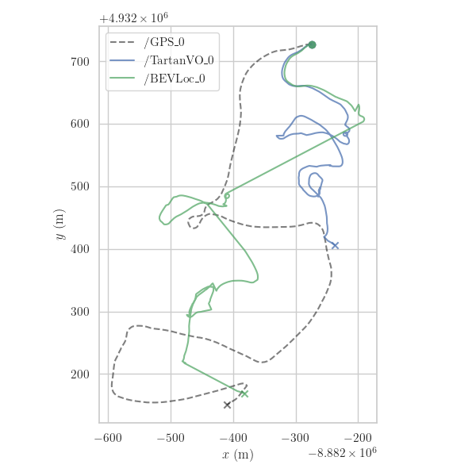
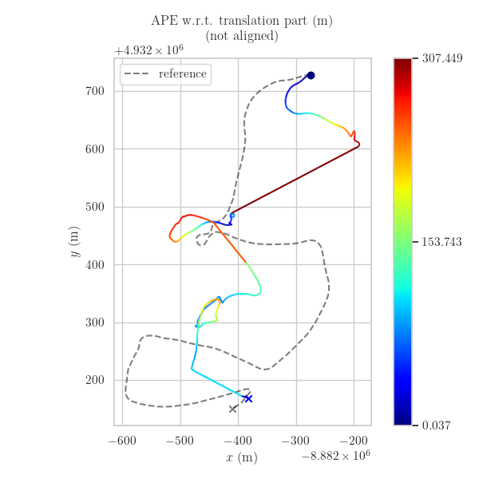
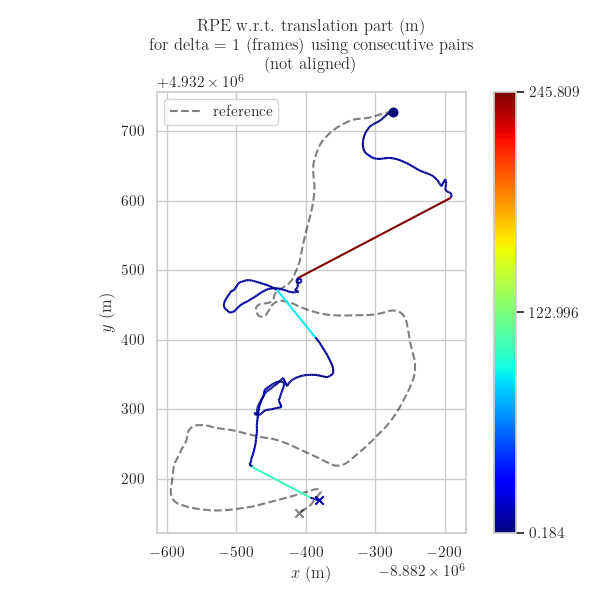

# BEVLoc: Cross-View Localization and Matching Via Birds-Eye-View Synthesis
This is an algorithm centered around matching ground-to aerial images in order to derive global state information from:
* A prior GPS location
* An arbritrary number of cameras
* A given GPS satellite image at the GPS location

This global state estimation looks to then further optimize the SLAM system using these global positions as unary factors in a VO factor graph backend.

## Abstract
Ground to aerial matching is a crucial and challenging task in outdoor robotics, particularly when GPS is absent or unreliable. Structures like buildings or large dense forests create interference, requiring GNSS replacements for global positioning estimates. The true difficulty lies in reconciling the perspective difference between the ground and air images for acceptable localization. Taking inspiration from the autonomous driving community, we propose a novel framework for synthesizing a birds-eye-view (BEV) scene representation to match and localize against an aerial map in off-road environments. We leverage contrastive learning with domain specific hard negative mining to train a network to learn similar representations between the synthesized BEV and the aerial map. During inference, BEVLoc guides the identification of the most probable locations within the aerial map through a coarse-to-fine matching strategy. Our results demonstrate promising initial outcomes in extremely difficult forest environments with limited semantic diversity. We analyze our model's performance for coarse and fine matching, assessing both the raw matching capability of our model and its performance as a GNSS replacement. Our work delves into off-road map localization while establishing a foundational baseline for future developments in localization.


## Navigation Visualization

### Figure 8 Turnpike






### Turnpike Flat


## Models:
The variants use for our model are [here](https://drive.google.com/drive/folders/1kO5l0wqgZIxC5nwFHFdTMuvFa7GUTX5v?usp=drive_link)


## Setup:
### Installing GDAL:
```
apt-get update
apt-get install libgdal-dev python3.8-dev -y
pip install GDAL==$(gdal-config --version) --global-option=build_ext --global-option="-I/usr/include/gdal" 
```

### Installing the Package
```
poetry install
```
